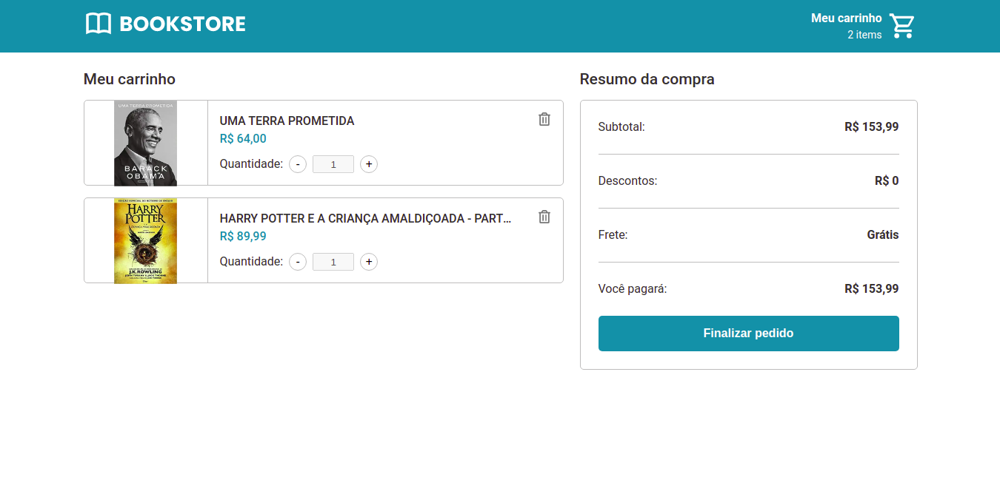
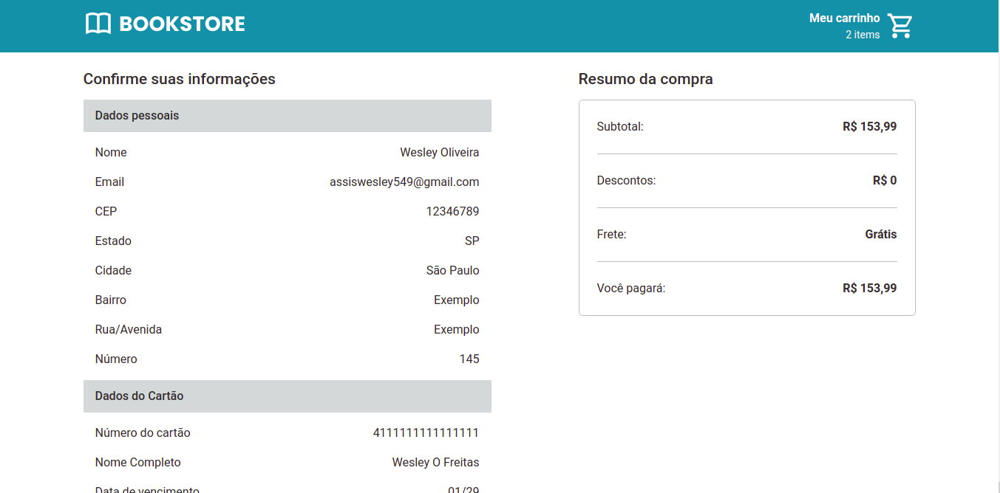

<p align="center">
  
</p>

<p align="center">Uma simples loja virtual de livros usando Node.JS, Next.Js, Typescript e outros.</p>

<p align="center">
  
  
  
  
</p>

## Sobre

Bookstore nada mais é do que uma simples loja virtual de livros onde tem como principais funcionalidades um fluxo de escolha de produto, carrinho e checkout para pagamento, o principal objetivo de realizar este projeto foi para aprender e entender como funcionam certas tecnologias como Next.JS, conceitos de SSR (Server Side Rendering), fluxo de checkout entre outros. Essas são as principais telas:

### Tela de produtos

<p align="center">
  
</p>

### Carrinho de compras

<p align="center">
  
</p>

### Tela de confirmação de compra

<p align="center">
  
</p>

### Preview

* [Protótipo no Figma](https://www.figma.com/file/Tn4MBHcoqaa3ZNdtse6uCK/Ecommerce?node-id=106%3A291)

### Funcionalidades

- [x] Listagem de produtos
- [x] CRUD de produtos no carrinho de compras
- [x] Checkout 1 - Formulário de informações de envio
- [x] Checkout 2 - Escolha de método de pagamento

### Tecnologias utilizadas

* [Typescript](https://www.typescriptlang.org/)
* [Next.JS](https://nextjs.org/)
* [Styled components](https://styled-components.com/)
* [Redux](https://redux.js.org/)
* [Node.JS](https://nodejs.org/en/)
* [Typeorm](https://typeorm.io/#/)
* [PostgreSQL](https://www.postgresql.org/)
* [Yarn](https://yarnpkg.com/)

## Instalação

OBS: Vou levar em consideração de que você já possui o Git, NodeJS e o Yarn instalados.

Antes de começarmos é importante ressaltar que este repositório utiliza uma estrutura de monorepo, caso não saiba oque isso significa recomendo que leia este artigo sobre [Como funciona um monorepo em JavaScript](https://medium.com/ifood-tech/como-funciona-um-monorepo-em-javascript-46abaa8f8b13). Dito isso vamos começar!

Um dos requisitos do projeto é ter instalado PostgresSQL na sua máquina, caso não tenha basta entrar no [site do postgres](https://www.postgresql.org/download/) e fazer o download, a instalação é super tranquila.

OBS: No processo de instalação/configuração do postgres você irá escolher um nome de usuário e senha do seu banco de dados, guarde essas informações pois usaremos elas mais tarde.

O próximo passo é clonar o repositório para a sua máquina, para isso abra seu terminal na pasta em que deseja fazer o donwload e digite:

```
  git clone https://github.com/wesleyoliveira820/bookstore.git
```

Neste momento você pode abrir a pasta do projeto no seu editor/IDE favorito.

## Inicializando o projeto

Agora com o seu terminal aberto na raiz do projeto digite:

```
  yarn
```

Este comando irá instalar todas as dependências que o projeto necessita para rodar.

Agora em packages/server renomeie o arquivo .env.example para .env abra o arquivo e nele você verá algumas informações, estas são as variáveis de ambiente que o projeto utiliza para rodar, lembra daquele nome de usuário e senha do postgres? Então, essas informações serão colocadas aqui em seus respectivos campos, modifique estes campos conforme necessitar.

Seguindo no tutorial volte para o terminal ainda na pasta raiz do projeto, iremos inicializar o servidor do backend e para isso digite:

```
yarn workspaces @bookstore/server dev:server
```

Para inicializar o frontend o comando é bem semelhante, alterando o nome do pacote:

```
yarn workspaces @bookstore/client dev
```

Agora basta abrir https://localhost:3000 no navegador e vualá!
